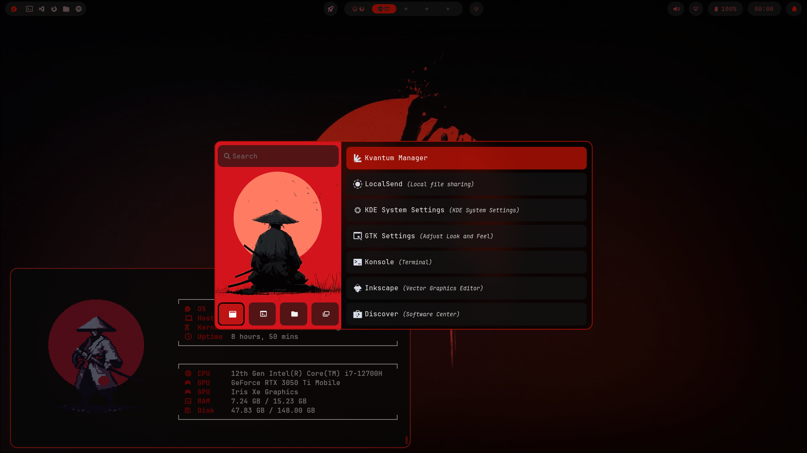
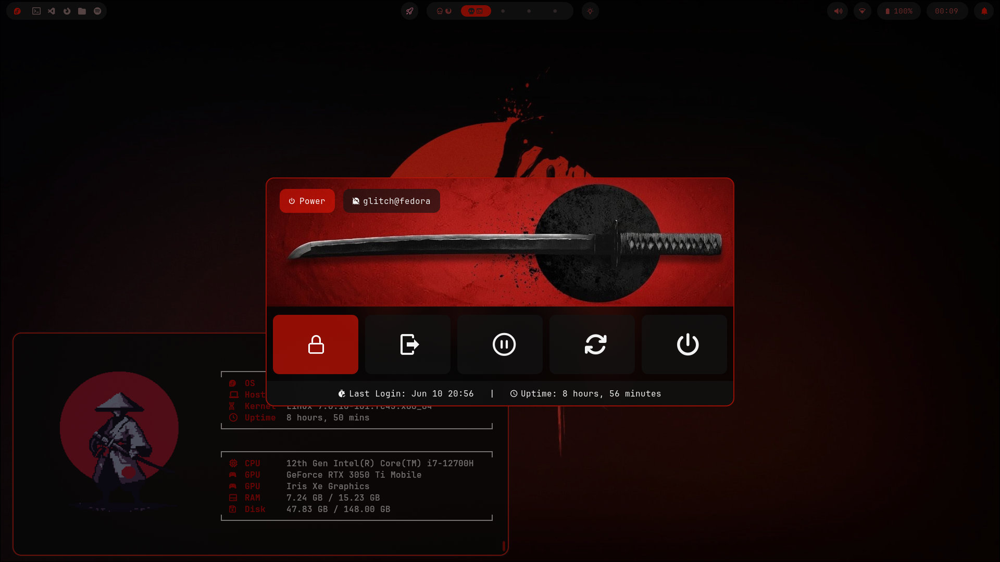
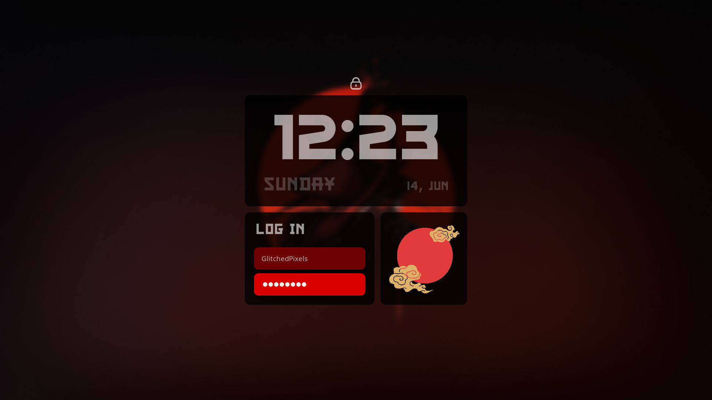

<div align="center">

# Benihagane Hyprland Dots

**A modern, aggressive Red Accent on Black Samurai theme for Hyprland.**


<br/>

<div align="center">
  
https://github.com/user-attachments/assets/ccfb315c-20a1-4813-a4da-ee7a2eee83bd

</div>

<table width="100%">
  <tr>
    <td width="25%" align="center"><b>Kitty & Dolphin</b><br/></td>
    <td width="25%" align="center"><b>App Launcher</b><br/></td>
    <td width="25%" align="center"><b>Power Menu</b><br/></td>
    <td width="25%" align="center"><b>Lockscreen</b><br/></td>
  </tr>
</table>

</div>

---

## Overview
This repository contains configuration files (dotfiles) for a Hyprland-based Wayland desktop environment. The configuration uses a custom "Red Accent on Black Samurai" color scheme, utilizing a deep black (`#0a0a0a`) background with red (`#d61406`) accents across the desktop components.

### Components
- **Window Manager**: [Hyprland](https://hyprland.org/) configured with dynamic tiling, custom window gaps, and defined animations.
- **Status Bar**: **Waybar** with a modular layout displaying system information, workspaces, and a power menu.
- **Terminal Emulator**: **Kitty** configured with JetBrainsMono Nerd Font, custom window padding, and a tailored tab bar.
- **Application Launcher**: **Rofi** (Wayland fork) styled to match the theme. Handles application launching, clipboard history (`cliphist`), and power menus.
- **Lock & Idle Management**: **Hyprlock** for screen locking and **Hypridle** configured for progressive screen dimming and system suspension based on timeouts.
- **Notifications**: **Swaync** configuration for system notifications and a control center (currently a Work In Progress).

---

## Requirements

Before installing, ensure you have a working Wayland environment and the appropriate graphics drivers.
You will need the following core packages (names may vary slightly by distro):

- `hyprland` `hyprlock` `hypridle` `hyprpaper`
- `waybar` `kitty` `rofi-wayland` `swaync`
- `cliphist` `grim` `slurp` `wl-clipboard`
- `fastfetch` `qt6ct` `kvantum` 
- **Fonts:** `ttf-jetbrains-mono-nerd` (or similar Nerd Fonts). You'll also need the custom fonts **CF Samurai Bob** and **The Last Shuriken** for the Hyprlock screen to display correctly.

---

## Installation

1. **Clone the repository:**
   ```bash
   git clone https://github.com/RishiIRL/Benihagane-Hyprland-Dotfiles.git ~/dotfiles
   cd ~/dotfiles
   ```

2. **Backup your existing configurations:**
   ```bash
   mkdir -p ~/.config/backup
   mv ~/.config/hypr ~/.config/waybar ~/.config/kitty ~/.config/rofi ~/.config/swaync ~/.config/backup/ 2>/dev/null || true
   ```

3. **Copy the dotfiles:**
   ```bash
   cp -r hypr waybar kitty rofi swaync Kvantum fastfetch ~/.config/
   chmod +x ~/.config/hypr/scripts/*.sh
   ```

4. **Set your Wallpaper:**
   Place your desired wallpaper at `~/.config/hypr/Wallpaper.jpg`.

5. **Log out and log back into the Hyprland session!**

---

## Keybindings Preview

*Most default keybinds use the `SUPER` key. You can find the full list in `~/.config/hypr/keybindings.conf`.*

| Action | Shortcut |
| :--- | :--- |
| **App Launcher (Rofi)** | `Super + Space` |
| **Launch Terminal** | `Super + T` |
| **File Explorer** | `Super + E` |
| **Text Editor** | `Super + C` |
| **Web Browser** | `Super + B` |
| **Close Window** | `Super + Q` |
| **Toggle Floating** | `Super + W` |
| **Toggle Group** | `Super + G` |

---

## Structure

```text
~/.config/
├── hypr/        # Hyprland WM configs, Lock, Idle, and Scripts
├── waybar/      # Modular status bar & custom CSS styling
├── kitty/       # Terminal configuration & tab bar scripts
├── rofi/        # App launcher, power menu, and network dialogs
├── swaync/      # Notification daemon (WIP)
├── Kvantum/     # Qt theming (NoMansSkyJux theme variant)
└── fastfetch/   # System fetch branding
```

---

## Known Backlogs & To-Do

Contributions are highly welcome, especially for the active backlogs!

- [ ] **Bluetooth Management (`bt-backlog.sh`)**: The script is currently copied from [rofi-bluetooth](https://github.com/nickclyde/rofi-bluetooth) by nickclyde and hasn't been adapted yet to fit the custom Rofi theme style (like the Wi-Fi script).
- [ ] **Network Script Hardcoding**: The `networks.sh` script currently has network interface drivers hardcoded. Needs optimization to dynamically detect interfaces.
- [ ] **Swaync Customization**: The notification center design is incomplete. I am tracking other priorities, so PRs are very welcome here!
- [ ] **Window Rules**: Application-specific window rules (`windowrules.conf`) are currently disabled because they aren't working in this setup. The root cause hasn't been investigated yet.

---

## License & Credits

- Licensed under the [MIT License](LICENSE).
- Inspired by the incredible Linux ricing community. If you fork or borrow, please adhere to the repository license.
